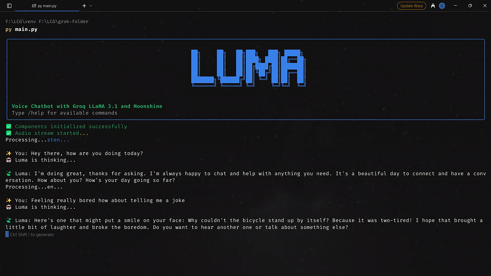

## LUMA - Voice AI Assistant

A real-time voice chatbot powered by Groq [LLaMA 3.1](https://ai.meta.com/blog/meta-llama-3-1/) and [Moonshine](https://arxiv.org/pdf/2410.15608) speech recognition.



Just  `pip install` and `GROQ_API_KEY`, Speak with your favourite Bot on all availiable models on [GroqCloud](https://console.groq.com/docs/models) Everything `Locally`!

[video demo](https://www.linkedin.com/posts/activity-7337107157206691840-DEVy?utm_source=share&utm_medium=member_ios&rcm=ACoAAEIsd7wB71woMUIyJQYneeIj6Dl_o4zwWq4)

## Features

### Core Capabilities
- Seamless voice-to-voice conversations
- Real-time speech recognition
- Natural language AI responses
- Text-to-speech output
- Beautiful terminal interface

### Smart Features
- Context-aware conversations
- Automatic speech detection
- Real-time processing
- Command system for control
- Session statistics

The diagram above illustrates LUMA's core components and their interactions:

1. **Audio Processing**:
   - Raw audio input capture
   - Silero VAD for speech detection
   - Audio buffering and chunking

2. **Speech Processing Pipeline**:
   - Moonshine ASR for speech-to-text
   - Groq LLaMA 3.1 for language processing
   - pyttsx3 for text-to-speech synthesis

3. **System Components**:
   - Terminal UI for interaction
   - Session statistics tracking
   - Command handler system

## Quick Start

```bash
python -m venv venv && venv\Scripts\activate
pip install -r requirements.txt
# Add GROQ_API_KEY to .env file
python main.py
```

---
Feel free to clone it, use it, and have fun! 🌟

Make a pull request to refactor the code, model usage, or contribute features.
