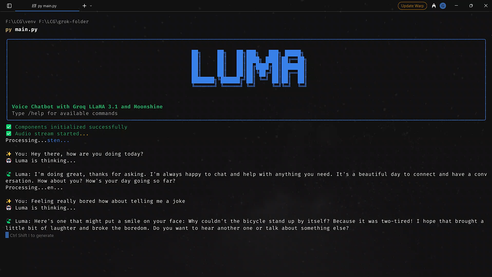

# LUMA - Voice AI Assistant

A real-time voice chatbot powered by Groq [LLaMA 3.1](https://ai.meta.com/blog/meta-llama-3-1/) and [Moonshine](https://arxiv.org/pdf/2410.15608) speech recognition.



[Watch Demo Video](demos/luma-demo.mp4)

Just  `pip install` and `GROQ_API_KEY`, Speak with your favourite Bot on all availiable models on [GroqCloud](https://console.groq.com/docs/models)

## Features

### Core Capabilities
- Seamless voice-to-voice conversations
- Real-time speech recognition
- Natural language AI responses
- Text-to-speech output
- Beautiful terminal interface

### Smart Features
- Context-aware conversations
- Automatic speech detection
- Real-time processing
- Command system for control
- Session statistics

## Quick Start

```bash
python -m venv venv && venv\Scripts\activate
pip install -r requirements.txt
# Add GROQ_API_KEY to .env file
python main.py
```

For detailed setup instructions, configuration, and troubleshooting, see our [Technical Documentation](https://mc095.github.io/jsonparser/setup-luma.html)

## Available Commands
- `/help` - Show help menu and usage
- `/stats` - Show session statistics
- `/exit` - Exit program

---
Feel free to clone it, use it, and have fun! 🌟

Make a pull request to refactor the code, model usage, or contribute features.
